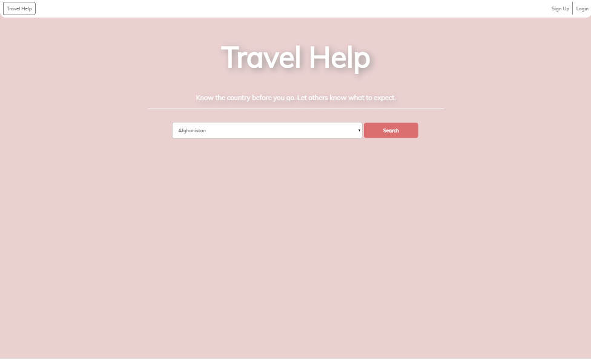
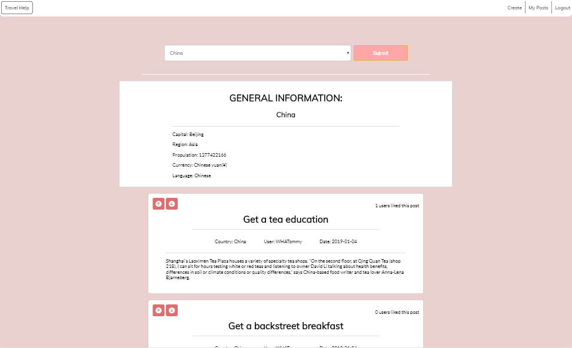
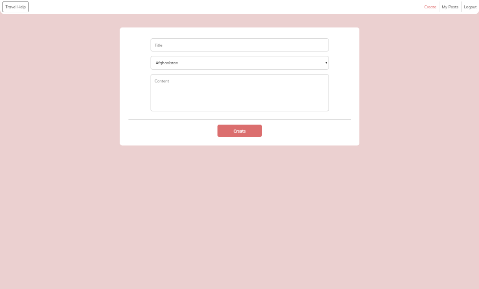
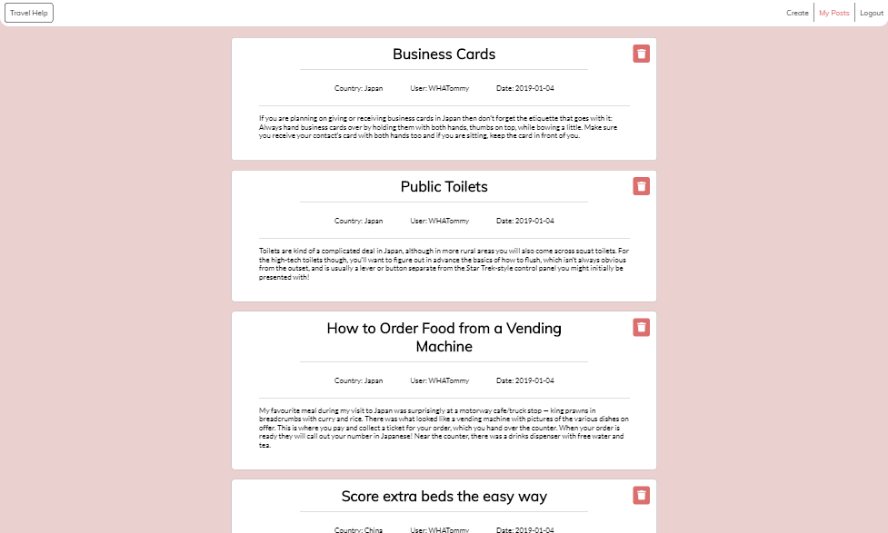

# Travel Helps
A forum of traveling tips from other travelers. Know the country before you go & let others know 
what to expect when visiting one!

### Demo Link: 
https://travelhelps.herokuapp.com/

### Demo Account:
Email: testing@gmail.com 

Password: testing

### Installation steps: 

  1. In your terminal, run **git clone https://github.com/WHATommy/TravelHelps.git**
  2. Switch to TravelHelps directory(**cd TravelHelps**)
  3. Retrieve the dependencies(**run npm install**)
  4. Switch into the frontend folder(**cd frontend**)
  5. Retrieve the dependencies(**run npm install**)
  6. Switch out of the frontend folder(**cd ..**)
  7. In the config folder, insert your own nonSQL database(ex. mLab) or leave as is to use a default database.
  8. From the TravelHelps root directory, enter **npm run dev** to run the app on a local server
  9. Open your browser to **localhost:3000**(If it has not open automatically)

### Screenshots:

